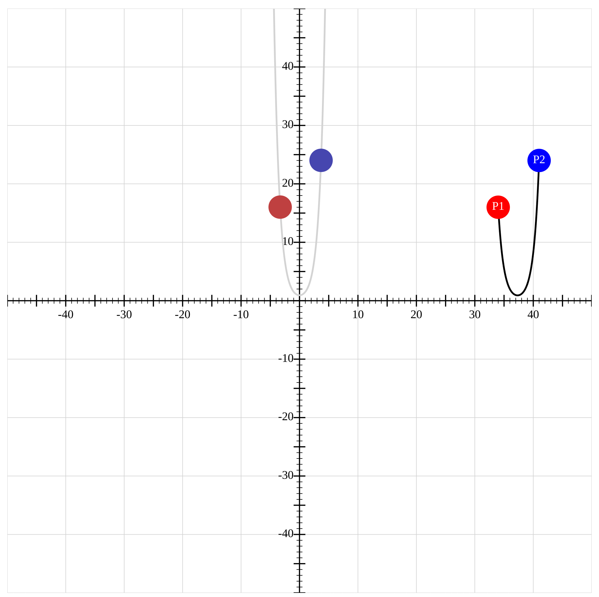
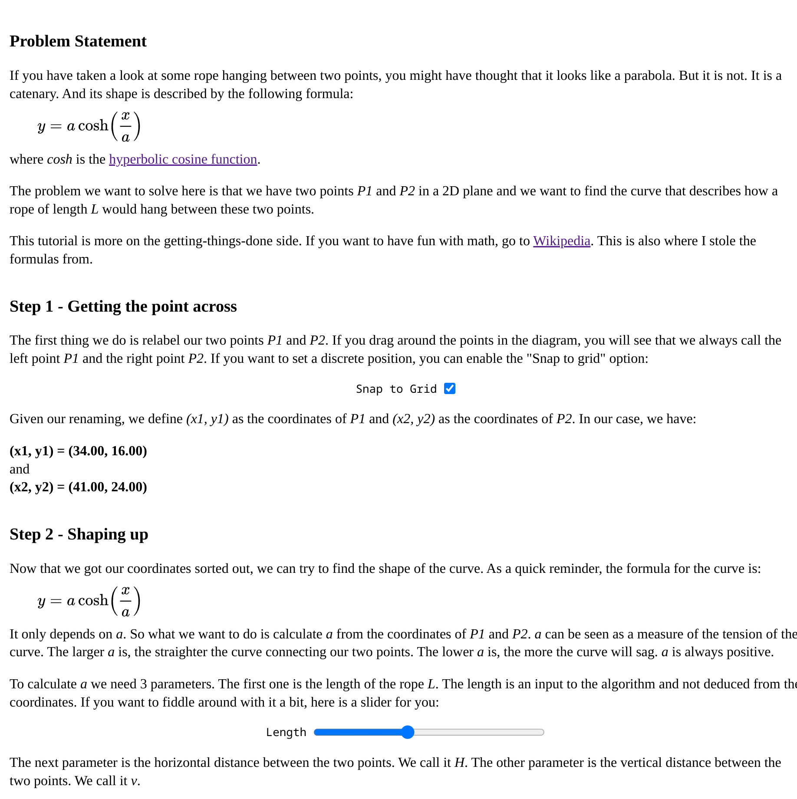

## Interactive Catenary Tutorial

Hi, this github repo is a interactive tutorial on how to draw a catenary between two points made with scalajs and Laminar.

You can find an interactive demo [here](https://catenary.sabix2.sabix.eu)

Here is how it looks:

